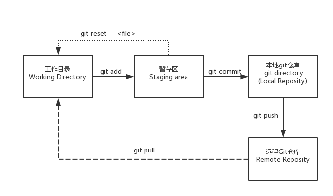

# Git常用操作

**用一张图帮助你快速理解和记忆**



## 准备工作
#### 下载
	- windows下载git-scm
	- Linux使用sudo apt-get install git或者yum install git

#### 克隆代码

```
git clone URL
```
- HTTPS，每次都需要输入账号和密码

- SSH，需要添加公钥（推荐方式）
生成密钥 `ssh-keygen -t rsa`，
将公钥( ~/.ssh/id_rsa.pub)粘贴到Gitlab >> User Settings >> SSH Keys

tips: 快速下载网上开源项目，使用`git clone --depth=1`

## 工作流程

一般工作流程如下：

```
git pull origin master   // 拉取最新代码   
git checkout -b dev  // 新建dev并切换到dev分支   
// git pull origin master:dev // 可以代替上面两句    
vim test.py  //修改代码   
git status  // 查看当前状态   
git add test.py  // 将修改添加到暂存区   
git status    
git commit -m "fix issue #1"// 提交到本地仓库(当前目录的.git目录)    
git push origin dev  // 推送到远程dev分支   
在gitlab上点击提交request merge, 发给组员review后再merge
```

[参考廖雪峰教程](https://www.liaoxuefeng.com/wiki/0013739516305929606dd18361248578c67b8067c8c017b000/0013745374151782eb658c5a5ca454eaa451661275886c6000)

#### 拉取和合并
git fetch和git pull区别：

git fetch是从远程获取最新到本地，不会自动merge.而git pull则从远程获取最新版本并且merge到本地

```
git fetch origin master:tmp //从远程仓库master分支获取最新到本地tmp分支

git diff tmp //将当前分支和tmp进行对比

git merge tmp //合并master分支到当前分支

//以上相当于一条命令： 
git pull origin master
```
*使用git fetch更安全，可以选择是否合并


### 常见场景

#### 遇到代码冲突
场景：使用git merge或者git pull遇到冲突，无法自动合并。如下：

```
Auto-merging readme.txt
CONFLICT (content): Merge conflict in readme.txt
Automatic merge failed; fix conflicts and then commit the result.
```
解决方法：
[参考](https://www.liaoxuefeng.com/wiki/0013739516305929606dd18361248578c67b8067c8c017b000/001375840202368c74be33fbd884e71b570f2cc3c0d1dcf000)


#### 突然接到需求
场景：你在写某个功能，但还没完成不想提交。突然接到需求，需要切到某个分支fix某个bug.

```
git stash // 保存当前修改进度

git stash list // 查看所有进度列表

git stash pop //从恢复进度

```

#### 其他常用命令
把修改文件从暂存区切回工作目录 `git reset -- <file>`

把所做修改都撤销 `git checkout -- <file>`

查看所有分支`git branch -v`

查看日志`git log`

查看历史命令`git reflog`

回滚到某个commit `git reset`

切回到某个分支 `git checkout <commit_id>`

切换到某个分支 `git checkout <branch_name>`

修改commit历史 `git rebase -i <commit_id>`


Git教程[参考文档](https://git-scm.com/book/zh/v2)

